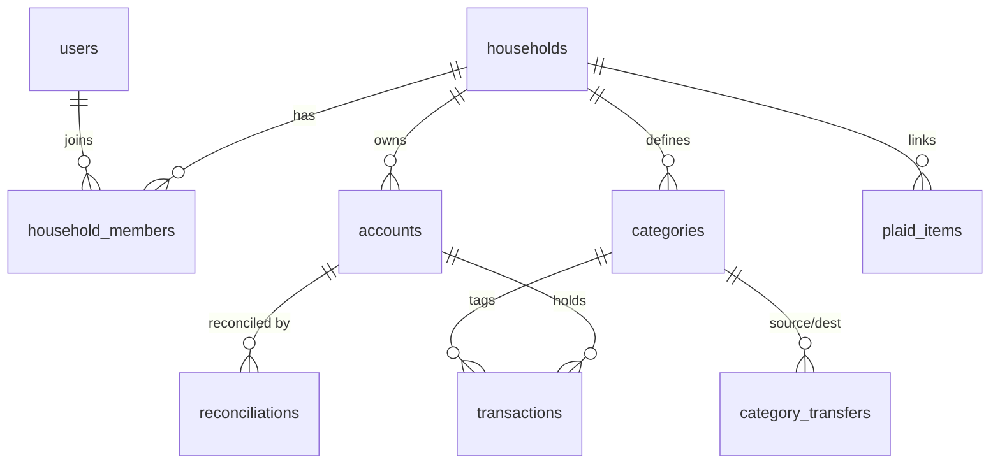

# Dojo – Data Model

> Primary keys are `UUID` (v4).  All timestamps are `TIMESTAMPTZ NOT NULL DEFAULT now()`.  Naming convention = **snake\_case**.

---

## 1 Entity–relationship sketch (mermaid)



---

## 2 Postgres base tables

### 2.1 `users`

```sql
CREATE TABLE users (
    id              UUID PRIMARY KEY,
    email           TEXT UNIQUE NOT NULL,
    password_hash   TEXT NOT NULL,
    full_name       TEXT,
    created_at      TIMESTAMPTZ DEFAULT now() NOT NULL,
    updated_at      TIMESTAMPTZ DEFAULT now() NOT NULL
);
```

### 2.2 `households`

```sql
CREATE TABLE households (
    id              UUID PRIMARY KEY,
    name            TEXT NOT NULL,
    default_currency TEXT NOT NULL DEFAULT 'USD',
    created_at      TIMESTAMPTZ DEFAULT now() NOT NULL
);
```

### 2.3 `household_members`

```sql
CREATE TABLE household_members (
    household_id    UUID REFERENCES households(id) ON DELETE CASCADE,
    user_id         UUID REFERENCES users(id) ON DELETE CASCADE,
    role            TEXT NOT NULL CHECK (role IN ('owner','member')),
    joined_at       TIMESTAMPTZ DEFAULT now() NOT NULL,
    PRIMARY KEY (household_id, user_id)
);
```

### 2.4 `account_type` enum

```sql
CREATE TYPE account_type AS ENUM ('asset','credit');
```

### 2.5 `accounts`

```sql
CREATE TABLE accounts (
    id              UUID PRIMARY KEY,
    household_id    UUID REFERENCES households(id) ON DELETE CASCADE,
    name            TEXT NOT NULL,
    type            account_type NOT NULL,
    starting_balance NUMERIC(14,2) NOT NULL,
    is_archived     BOOLEAN NOT NULL DEFAULT FALSE,
    created_at      TIMESTAMPTZ NOT NULL DEFAULT now()
);
CREATE INDEX idx_accounts_household ON accounts(household_id);
```

### 2.6 `category_type` enum

```sql
CREATE TYPE category_type AS ENUM ('group','standard','non_reportable','credit_payment');
```

### 2.7 `category_groups`

```sql
CREATE TABLE category_groups (
    id              UUID PRIMARY KEY,
    household_id    UUID REFERENCES households(id) ON DELETE CASCADE,
    name            TEXT NOT NULL,
    sort_order      INTEGER NOT NULL,
    created_at      TIMESTAMPTZ NOT NULL DEFAULT now()
);
```

### 2.8 `categories`

```sql
CREATE TABLE categories (
    id              UUID PRIMARY KEY,
    household_id    UUID REFERENCES households(id) ON DELETE CASCADE,
    group_id        UUID REFERENCES category_groups(id) ON DELETE SET NULL,
    name            TEXT NOT NULL,
    type            category_type NOT NULL DEFAULT 'standard',
    monthly_amount  NUMERIC(14,2) NOT NULL DEFAULT 0,
    goal_amount     NUMERIC(14,2),
    is_archived     BOOLEAN NOT NULL DEFAULT FALSE,
    sort_order      INTEGER NOT NULL,
    created_at      TIMESTAMPTZ NOT NULL DEFAULT now()
);
CREATE INDEX idx_categories_household ON categories(household_id);
```

### 2.9 `transaction_status` + `transaction_source` enums

```sql
CREATE TYPE transaction_status AS ENUM ('pending','settled');
CREATE TYPE transaction_source AS ENUM ('manual','plaid','system');
```

### 2.10 `transactions`

```sql
CREATE TABLE transactions (
    id              UUID PRIMARY KEY,
    household_id    UUID REFERENCES households(id) ON DELETE CASCADE,
    date            DATE NOT NULL,
    payee           TEXT,
    memo            TEXT,
    account_id      UUID REFERENCES accounts(id) ON DELETE CASCADE,
    category_id     UUID REFERENCES categories(id) ON DELETE SET NULL,
    inflow          NUMERIC(14,2) NOT NULL DEFAULT 0,
    outflow         NUMERIC(14,2) NOT NULL DEFAULT 0,
    status          transaction_status NOT NULL,
    source          transaction_source NOT NULL,
    external_id     TEXT UNIQUE, -- plaid transaction_id or NULL
    created_by      UUID REFERENCES users(id),
    created_at      TIMESTAMPTZ NOT NULL DEFAULT now(),
    updated_at      TIMESTAMPTZ NOT NULL DEFAULT now()
);
CREATE INDEX idx_tx_household_date ON transactions(household_id,date DESC);
CREATE INDEX idx_tx_account_status ON transactions(account_id,status);
```

### 2.11 `category_transfers`

```sql
CREATE TABLE category_transfers (
    id              UUID PRIMARY KEY,
    household_id    UUID REFERENCES households(id) ON DELETE CASCADE,
    date            DATE NOT NULL,
    from_category_id UUID REFERENCES categories(id) ON DELETE RESTRICT,
    to_category_id   UUID REFERENCES categories(id) ON DELETE RESTRICT,
    amount          NUMERIC(14,2) NOT NULL CHECK (amount > 0),
    memo            TEXT,
    created_by      UUID REFERENCES users(id),
    created_at      TIMESTAMPTZ NOT NULL DEFAULT now()
);
```

### 2.12 `reconciliations`

```sql
CREATE TABLE reconciliations (
    id              UUID PRIMARY KEY,
    household_id    UUID REFERENCES households(id) ON DELETE CASCADE,
    account_id      UUID REFERENCES accounts(id) ON DELETE CASCADE,
    reconciled_at   TIMESTAMPTZ NOT NULL,
    statement_balance NUMERIC(14,2) NOT NULL,
    created_by      UUID REFERENCES users(id)
);
```

### 2.13 `plaid_items`

```sql
CREATE TABLE plaid_items (
    id              UUID PRIMARY KEY,
    household_id    UUID REFERENCES households(id) ON DELETE CASCADE,
    access_token    TEXT NOT NULL,
    institution     TEXT,
    created_at      TIMESTAMPTZ NOT NULL DEFAULT now()
);
```

---

## 3 Materialised views (analytics)

*Balancing and report queries run against DuckDB; we export the OLTP tables nightly.*  Still, for parity checks in Rust we define two Postgres materialised views to speed up dashboard queries:

```sql
CREATE MATERIALIZED VIEW v_category_balance AS
SELECT  c.id               AS category_id,
        c.household_id,
        COALESCE(SUM(t.inflow - t.outflow),0) +
        COALESCE(SUM(ct_in.amount),0) - COALESCE(SUM(ct_out.amount),0) AS balance
FROM    categories c
LEFT JOIN transactions t      ON t.category_id = c.id AND t.status = 'settled'
LEFT JOIN category_transfers ct_in  ON ct_in.to_category_id = c.id
LEFT JOIN category_transfers ct_out ON ct_out.from_category_id = c.id
GROUP BY c.id;

CREATE MATERIALIZED VIEW v_account_balance AS
SELECT  a.id as account_id,
        a.household_id,
        a.starting_balance + COALESCE(SUM(t.inflow - t.outflow),0) AS balance
FROM    accounts a
LEFT JOIN transactions t ON t.account_id = a.id AND t.status = 'settled'
GROUP BY a.id;
```

Refresh strategy: `REFRESH MATERIALIZED VIEW CONCURRENTLY …` on every write or via logical decoding + RabbitMQ consumer (implementation detail in architecture doc).

---

## 4 Data‑integrity rules (enforced at DB layer)

1. `inflow` and `outflow` are mutually exclusive (`CHECK (inflow = 0 OR outflow = 0)`).
2. Category transfers cannot reference archived categories (`CHECK NOT (SELECT is_archived FROM categories WHERE id = from_category_id)`).
3. Household isolation: every FK points into the same `household_id` via `DEFERRABLE INITIALLY DEFERRED` FK plus application‑layer cascade.
4. `external_id` ensures Plaid upserts are idempotent.

---

## 5 Audit & temporal history

We need full bitemporal versioning so that any query can answer **“What did the budget look like *as of edit‑time T*?”**.  PostgreSQL 16 gives us built‑in `SYSTEM VERSIONING`; we enable it on the four mutable, finance‑critical tables.

| Table                | Why keep history?                                         | Versioning config                                       |
| -------------------- | --------------------------------------------------------- | ------------------------------------------------------- |
| `transactions`       | Bank re‑posts or adjusts amounts; pending→settled updates | `ALTER TABLE transactions SET SYSTEM VERSIONING;`       |
| `category_transfers` | Users re‑allocate envelopes retroactively                 | `ALTER TABLE category_transfers SET SYSTEM VERSIONING;` |
| `categories`         | Monthly/goal adjustments change historical reports        | ditto                                                   |
| `accounts`           | Renames, archive flag flips                               | ditto                                                   |

### 5.1  DDL delta (example)

```sql
-- example for transactions
ALTER TABLE transactions
    ADD COLUMN sys_period tstzrange NOT NULL DEFAULT tstzrange(now(), NULL),
    ADD GENERATED ALWAYS AS IDENTITY,
    SET SYSTEM VERSIONING use sys_period;
```

Postgres transparently moves old rows to an internal history partition.  Queries can now time‑travel:

```sql
SELECT * FROM transactions FOR SYSTEM_TIME AS OF '2025‑06‑20 23:59:59+00';
```

### 5.2  Application API

* Every write still updates the base row; Postgres handles the history copy.
* The REST API gains an optional `as_of` query‑param (ISO‑8601) on report endpoints.  If present, handlers add `FOR SYSTEM_TIME AS OF $as_of` to SQL.
* Real‑time WebSocket events include `valid_from` timestamp; clients can reconstruct timelines if desired.

### 5.3  Governance

* History is **immutable**: only super‑admins can `ALTER TABLE ... DROP SYSTEM VERSIONING`.
* History retention = indefinite (tiny data volume).
* Full‑table VACUUM FREEZE runs weekly to keep bloat low.

---

