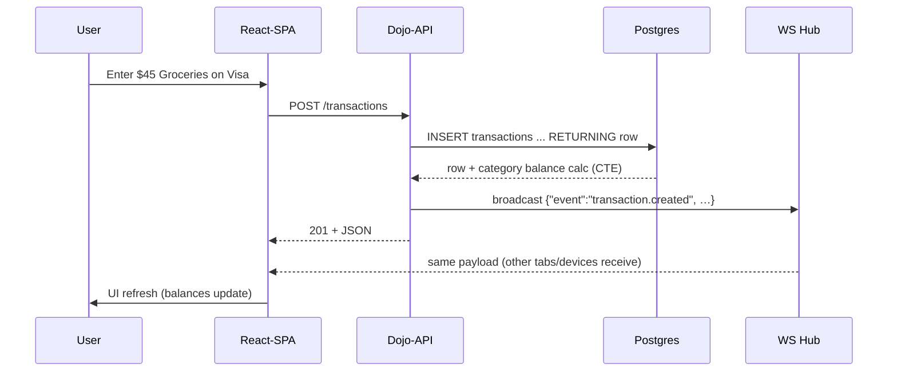

# 04 Architecture

> **North-star** – *One small Rust+TS service, one Postgres instance, zero paid add-ons.*

Aspire-Budget-Web (“**dojo**”) must run for two concurrent users at essentially zero cost, locally or on a cheap VM (e.g. Fly .io hobby plan).  
Peak data volume: <10 k transactions, <100 k WebSocket msgs / month.  
Therefore we optimise for **simplicity over hyperscale**.

---

## 1  Component Map

```mermaid
flowchart LR
  subgraph Browser (React + Vite) [frontend]
    UI[♢ UI Views]
    WS[♢ WS Client]
    APIClient[♢ REST Client]
  end
  subgraph Dojo-API (Rust + Axum) [backend]
    Router[(◻ router)]
    Auth[(◻ auth / OIDC verifier)]
    Realtime[(◻ ws hub)]
    SVC[(◻ domain service)]
  end
  subgraph Postgres 15 [db]
    core[(• tables)]
    temporal[(• bitemporal tables)]
  end
  UI -->|https| Router
  APIClient -->|https| Router
  WS -->|wss| Realtime
  Router --> SVC
  SVC --> core
  SVC --> temporal
  Realtime --> core
```

| ID | Description | Notes |
|----|-------------|-------|
| **UI** | React SPA built with Vite + TanStack Query | Static files can be embedded into the Rust binary or served by an Nginx sidecar. |
| **Router** | Axum routes generated from `03_api_contract.yaml` via `oai-gen` | Handles JSON & protobuf (future). |
| **Auth** | Google OAuth 2 / OIDC verifier | No third-party auth-as-a-service; uses Google’s free OAuth. |
| **SVC** | Pure Rust domain layer (transactions, categories, transfers) | Encapsulates business rules; talks to DB via SQLx. |
| **Realtime** | Tokio-tungstenite hub broadcasting JSON patches on channel `budget:<household_id>` | No message broker; hub holds in-memory subscriber map. |
| **core** | OLTP tables (`users`, `accounts`, `categories`, `transactions`, `transfers`) | As per `02_data_model.md`. |
| **temporal** | System-versioned history tables with `valid_from / valid_to` and statement triggers | Supports “show budget as-of DATE”. |

---

## 2  Deployment Topology

| Environment | How | Hosting | TLS | Backups |
|-------------|-----|---------|-----|---------|
| **Dev (laptop)** | `docker compose up` | Local containers | self-signed | Volume dump nightly via `pg_dump`. |
| **Staging** | `flyctl deploy --config fly.staging.toml` | Fly.io shared-CPU 256 MB | Fly certs | Fly PG free tier + 1 snapshot / day |
| **Prod** | `flyctl deploy` | Fly.io 1x shared-CPU machine | Fly certs | Fly PG hobby tier with automated nightly dump to S3-compatible bucket |

*Self-hosting alternative*: same container set on a VPS (Hetzner CX11) with Caddy for TLS.

---

## 3  Technology Choices (ADR-004 summary)

| Concern | Choice | Rationale |
|---------|--------|-----------|
| API transport | REST+JSON | Simple; auto-gen client types. |
| DB | **Postgres 15** only | Handles both OLTP and light analytic (`GROUP BY`, window funcs) workloads; supports triggers for temporal tables. |
| Migrations | SQLx CLI | Written once, no runtime reflection. |
| Real-time | WebSockets in same Axum app | Push budget updates instantly; no RabbitMQ/Kafka. |
| Auth | Google OAuth 2 “Sign-in with Google” | Free, familiar, refresh token lasts 6 mo. |
| CI/CD | GitHub Actions → Fly deploy | Single workflow file; failed deploy auto-rolls-back (`fly release revert`). |
| Observability | `tracing` → stdout; Fly logs | Overkill to run Prometheus/Grafana. |
| Local dev | `docker compose` (app, pg, pgadmin) | One-command spin-up; matches prod image tags. |

---

## 4  Runtime Concerns

* **Concurrency** – Axum runs on Tokio; DB pooled via `deadpool_postgres` (max = 10 conns).  
* **Performance** – p99 dashboard query ≤ 100 ms with a single `JOIN` on ~10 k rows.  
* **Fault tolerance** – stateless API container; Fly restarts on crash.  
* **Rollback** – Fly keeps last 5 releases; `fly releases list && fly release revert <id>` in CI on non-200 health check.  
* **Backups** – `pg_dump` to object storage, 30-day retention; restore doc in `05_migrations.md`.  
* **Security** – HTTPS/TLS only; OAuth callback restricted to configured domains; all cookies `Secure; SameSite=Lax`.  
* **Offline** – SPA caches last fetches with IndexedDB; mutations queued and replayed when online (future ADR-008).

---

## 5  Sequence Example – “record expense from phone”



Total round-trip < 200 ms on Fly free tier.

---

## 6  Open Items

| # | Topic | Decision date | Owner |
|---|-------|---------------|-------|
| 1 | Should static assets be embedded (`rust-embed`) or served via nginx sidecar? | TBD | @brandon |
| 2 | Multi-household support | defer to post-MVP | — |
| 3 | Mobile PWA installability | decide after first phone tests | — |
| 4 | Offline edit conflict strategy (CRDT vs last-write-wins) | ADR-009 (future) | — |

---

