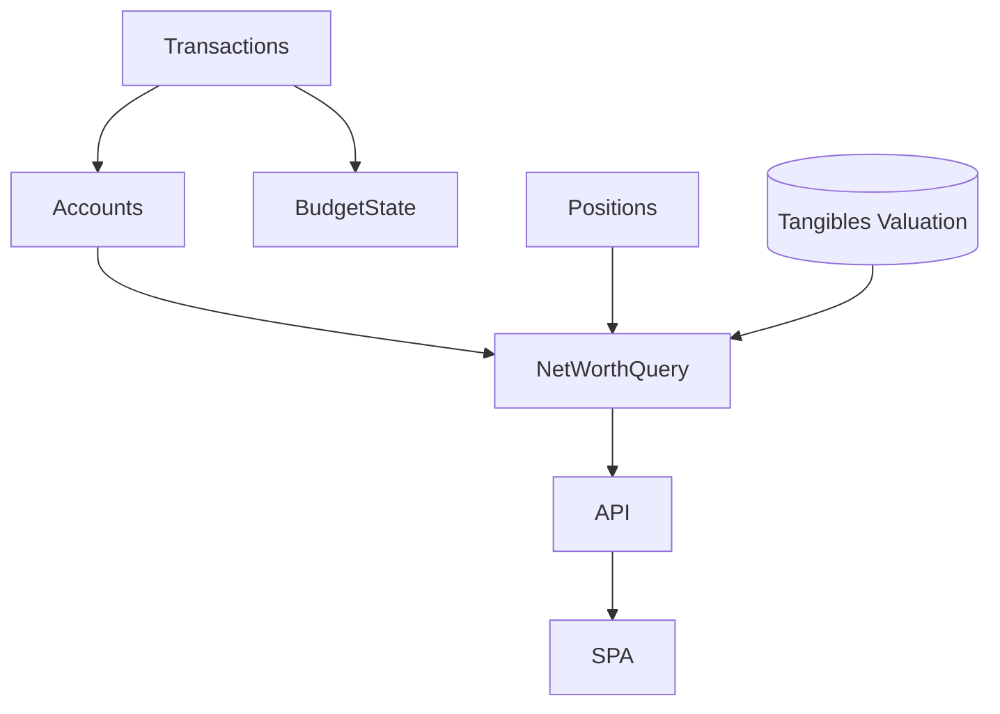

# Net Worth and Aggregation

The Net Worth domain serves as the central synthesis point of the application, aggregating data from all other modules to provide a single, comprehensive view of overall financial health and wealth preservation progress.

## Core Concept and Objectives

The core concept is the net worth equation:

> **Net Worth = Ledger Balances + Market Valuations + Tangible Fair Values**

Ledger balances are deterministic sums of inflows and outflows on financial accounts (cash, credit, accessible assets, long-term loans). Market valuations come from investment positions (share counts multiplied by market prices plus uninvested cash per brokerage account). Tangible fair values are user-maintained appraisals of physical assets.

The objective of this domain is to calculate this metric accurately, present it prominently, and enable high-speed historical analysis. Because the ultimate goal of the application is wealth preservation and accumulation, net worth is positioned as the primary metric.

## Data Sourcing and Calculation Logic

The MVP exposes a single **current snapshot** endpoint. Today it reads:

1. `accounts` filtered by `is_active = TRUE`, grouped on `account_type` (`asset` vs `liability`).
2. `positions` filtered by `is_active = TRUE` for investment overlays.

The SQL lives in `src/dojo/sql/core/net_worth_current.sql` and returns `(assets_minor, liabilities_minor, positions_minor, net_worth_minor)` in one pass. At this stage, tangible assets are modeled conceptually in the domain but are not yet part of the live query; their SCD‑2 valuation table will be integrated when implemented.

Conceptually, the domain treats inputs as:

- **Ledger balances**: cash, credit, accessible assets, and long-term loans derive their balances from the `transactions` table. Opening balances are explicit ledger entries; interest and fees appear as expense transactions or reconciliation-driven adjustments.
- **Investment overlays**: `positions` encode per-account holdings and current market value. Net worth aggregates both cash and positions per investment account.
- **Tangible valuations**: a dedicated tangibles table records `current_fair_value` for each tracked asset. Net worth uses the latest fair value for active tangibles once the table is present in the schema.

No history table exists yet; we plan to materialize a `net_worth_history` table once analytics demand it. That ADR will update this doc when work begins and will specify how tangibles and any future valuation sources are sampled and stored.

## Key Flows and Output

### Current Snapshot Reporting

- **Endpoint**: `GET /api/net-worth/current` (see `dojo.core.routers`).
- **Response**: Minor-unit integers plus a Decimal-friendly representation for UI display.
- **Usage**: SPA requests after every successful transaction post to keep the primary KPI visible.

### Baseline Data for Forecasting

This domain will later export both the instantaneous net worth and a smoothed spending baseline to Forecasting. For now it simply supplies the most recent snapshot, which is sufficient to close the write → KPI loop.
