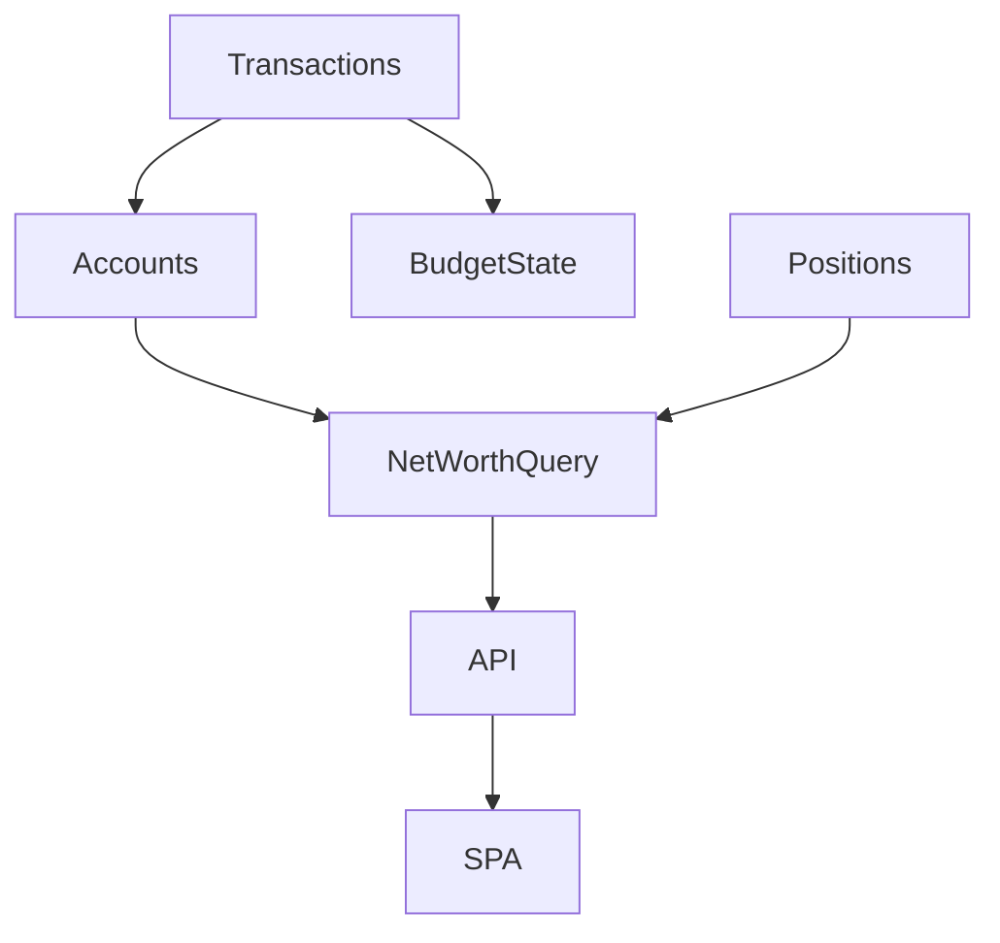

# Net Worth and Aggregation

The Net Worth domain serves as the central synthesis point of the application, aggregating data from all other modules to provide a single, comprehensive view of overall financial health and wealth preservation progress.

## Core Concept and Objectives

The core concept is the net worth equation: **Total Assets** - **Total Liabilities** = **Net Worth**. The objective of this domain is to calculate this metric accurately, present it prominently, and enable high-speed historical analysis. Because the ultimate goal of the application is wealth preservation and accumulation, net worth is positioned as the primary metric.

## Data Sourcing and Calculation Logic

The MVP exposes a single **current snapshot** endpoint. It reads:

1. `accounts` filtered by `is_active = TRUE`, grouped on `account_type` (`asset` vs `liability`).
2. `positions` filtered by `is_active = TRUE` for investment overlays.

The SQL lives in `src/dojo/sql/core/net_worth_current.sql` and returns `(assets_minor, liabilities_minor, positions_minor, net_worth_minor)` in one pass. No history table exists yet; we plan to materialize one when analytics demand it.

Future work: add a `net_worth_history` table populated by a background task once history/forecast visualizations ship. That ADR will update this doc when work begins.

## Key Flows and Output

### Current Snapshot Reporting

- **Endpoint**: `GET /api/net-worth/current` (see `dojo.core.routers`).
- **Response**: Minor-unit integers plus a Decimal-friendly representation for UI display.
- **Usage**: SPA requests after every successful transaction post to keep the primary KPI visible.

### Baseline Data for Forecasting

This domain will later export both the instantaneous net worth and a smoothed spending baseline to Forecasting. For now it simply supplies the most recent snapshot, which is sufficient to close the write → KPI loop.
