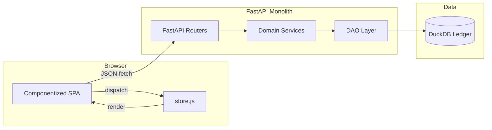
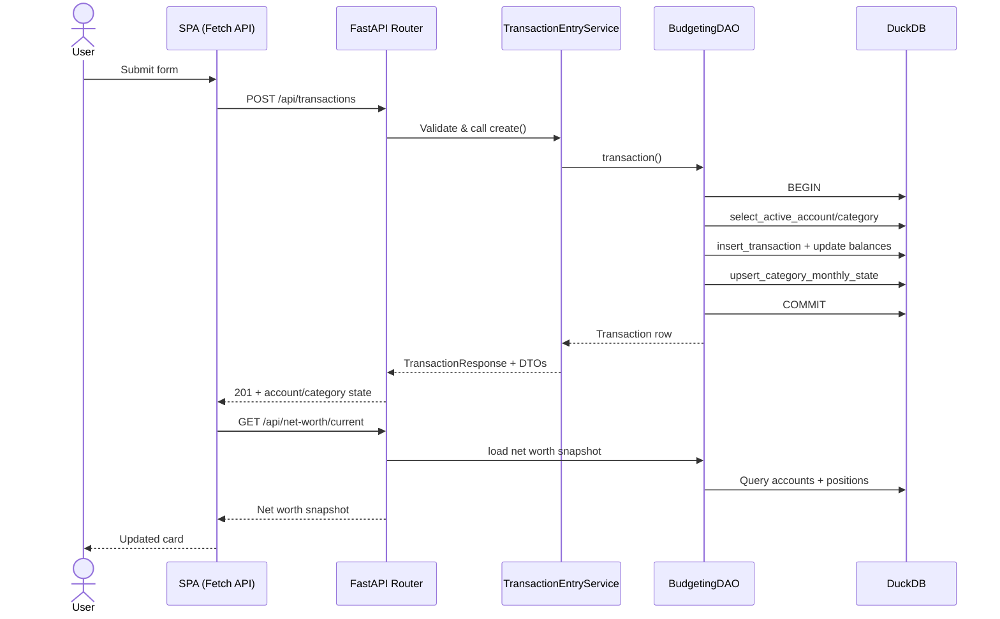
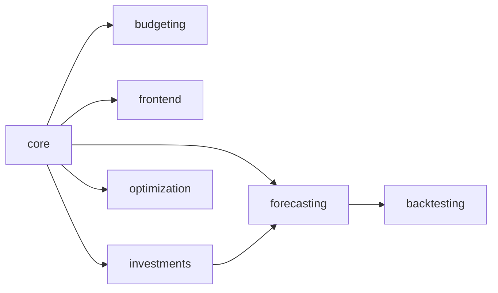

# Dojo Architecture

This document serves as the foundational guide for the dojo application, outlining its core objectives, architectural model, data storage strategy, and module organization. The system is designed to provide a robust, auditable, and analytically superior replacement for spreadsheet-based financial tracking.

## Top-Level Objectives

The application’s architecture is driven by four primary goals, ensuring it meets the unique needs of a financially focused household:

1.  **Net Worth First**: The ultimate measure of financial health—wealth accumulation and preservation—must be central to the user experience. All budgeting, investment tracking, and transactional activities are architected as actions that directly feed into, and influence, the primary net worth metric.
2.  **Operational Simplicity**: The system is designed for ease of deployment, maintenance, and low resource utilization, suitable for a single-container deployment environment. This is achieved through a fully integrated, self-contained monolithic architecture, eliminating external service dependencies like message queues or distributed databases.
3.  **Auditability and Reconciliation**: A core requirement is solving the historical pain points of data discrepancies and reconciliation. The architecture ensures that every change to critical financial data is preserved and versioned, allowing users to accurately "time-travel" the data back to any historical point to align account balances with external statements.
4.  **Actionable Forecasting**: The application must empower financial longevity through scenario planning. It needs to provide a fast and reliable "What-If" engine that leverages analytical models to immediately project the long-term net worth probability distribution based on proposed changes, such as budget adjustments or investment decisions.

## Core Architecture and Data Model

### Monolithic Structure

The entire application ships as a single FastAPI process created by `dojo.core.app:create_app`. The factory wires routers from every domain module, builds the dependency container (settings, DAO instances, transaction helpers), and mounts the compiled SPA assets from `src/dojo/frontend/static/`. This keeps request routing, DuckDB access, and frontend asset serving in one process and maintains the low-latency coupling between business logic and persistence.

### Single-Store Data Model

The entire data store relies on a single DuckDB file (located at `/data/app.duckdb`). DuckDB is a powerful analytical data management system that is perfectly suited for this application because it effectively handles the application’s dual requirements:

-   **Transactional Data Entry (OLTP)**: It processes the low-volume, serialized `INSERT` operations required for day-to-day transaction input quickly and reliably.
-   **Analytical Processing (OLAP)**: It provides exceptional performance for the complex queries necessary for forecasting and detailed reporting.

This unified approach eliminates data synchronization and operational complexity.

### Temporal Data Management

To meet the high auditability requirements, core financial data (such as transactions and investment positions) is stored using a System-Versioned approach, often referred to as Slowly Changing Dimension (SCD) Type 2.

Instead of performing destructive `UPDATE` or `DELETE` operations, any modification to a record results in an atomic database transaction:

-   The currently active version of the record is logically closed by setting its `is_active` flag to `FALSE`.
-   A completely new row, containing the corrected or updated data, is inserted. This new row is marked `is_active = TRUE` and tagged with a system-generated `recorded_at` timestamp and the ID of the individual who performed the action.

This ensures that the current state is always readily available, but the entire history of changes is preserved. This robust history is the foundation for the reconciliation process, allowing the system to accurately determine the account balance as it was recorded at any historical point in time.

### Data Access Layer

Every domain module owns a `dao.py` file that encapsulates SQL access. DAO methods load statements from `src/dojo/sql/**`, translate results into typed dataclasses, and expose helpers such as `BudgetingDAO.transaction()` so the services never execute inline SQL. This separation makes the service layer responsible solely for orchestration and validation while DAO classes enforce DuckDB transaction boundaries and shared invariants.

## Code Structure

The FastAPI application is organized into logical, domain-driven modules, promoting clear separation of concerns:

### `/core`

This module serves as the application foundation, managing cross-cutting concerns. It houses the DuckDB connection dependency (`db.py`), standard data validation and structure schemas (`schemas.py`), and any common utilities necessary across the application.

### `/budgeting`

This domain focuses on the mechanics of the envelope budgeting system. It manages the endpoints for the day-to-day input of transactions, handles the monthly assignment of income to budget categories, and provides the core data retrieval logic used by the reconciliation interface. All persistent operations in this module utilize the temporal data model.

### `/investments`

This module handles portfolio tracking and data ingestion. It manages the storage of security positions, integrates with external market data providers (e.g., Yahoo Finance) to fetch live pricing, and calculates key performance metrics. These metrics include returns, risk, Sharpe ratios, and drawdowns, all of which are tracked against appropriate benchmarks like the S&P 500.

### `/forecasting`

This is the core analytical engine. It is responsible for loading historical spending profiles and investment data directly from DuckDB. It utilizes quantitative models and statistical methods (including parametric and non-parametric approaches) to project the probability distribution of future net worth over time. This module also processes user-defined scenarios—allowing users to model the impact of budget changes or large purchases—to provide actionable insights into long-term financial outcomes.

### `/optimization`

This module acts as the investment advisory layer. It consumes the optimal portfolio model generated offline by the evaluation framework, calculates the corresponding target allocation for the actual holdings, and generates tax-efficient rebalancing guidance. This guidance prioritizes trading in tax-advantaged accounts and identifying opportunities for tax-loss harvesting.

### `/backtesting`

This module contains the quantitative evaluation harness, referred to as the `BacktestEngine`. It is responsible for the reproducible and statistically rigorous assessment of investment strategies against historical and synthetically augmented market data.

### `/frontend`

The frontend lives under `src/dojo/frontend/static/`. `index.html` provides the mounting points, `main.js` composes hash-based routing plus feature modules (accounts, allocations, budgets, transactions, transfers, reference data), and `store.js` centralizes immutable application state. Supporting modules under `services/` wrap fetch, DOM helpers, and formatting, while `components/**/index.js` files own the DOM bindings and view updates for each page. Styles are split into shared primitives and feature-specific bundles that follow the BEM convention so Cypress selectors and layout rules remain isolated per component.

## System Context

- **Trust Boundary**: Browser ⇄ FastAPI (HTTPS termination point). DuckDB lives on the same host; we enforce a single-writer rule via request-scoped connections.
- **Upstream dependencies**: None in the MVP; all data is entered manually or seeded via migrations.

## Runtime Flow (Write Path)

**Failure branch**: If any DAO call raises, the context manager issues `ROLLBACK` before surfacing a structured 400 (domain validation) or 500 (unexpected) response. The SPA renders inline errors using FastAPI's validation payload while the store keeps the last known good state.

## Module Interaction Diagram

Only `core` may depend on DuckDB adapters and shared config. Domain modules may depend on `core` abstractions but never on each other (e.g., `budgeting` cannot import `forecasting`).

## Data & Contracts

- **accounts**: Canonical account balances; columns `account_id`, `name`, `account_type` (`asset` or `liability`), `current_balance_minor`, `currency`, `is_active`. Enforced via migration 0001. Account “classes” (cash, credit card, investment, loan, etc.) are modeled at the application layer and in per-class configuration tables described in the Assets & Liabilities document.
- **budget_categories** & **budget_category_monthly_state**: Track envelope allocations and available funds per month-start boundary, including liability payment envelopes (for example, `Payment: {Account}`) and generic debt categories.
- **transactions**: Temporal SCD Type 2 table; only `TransactionEntryService` can mutate it. Opening balances are recorded as explicit transactions using a dedicated “Opening Balance” category and a synthetic counterparty account.
- **Transactions API**: `POST /api/transactions` writes via the service, `GET /api/transactions?limit=N` streams recent active rows for the spreadsheet UI.
- **positions**: Optional investment snapshot table referenced by the net worth query; captures per-account holdings and current market value.
- **tangibles** (planned): SCD-2 valuation table for user-maintained fair values of physical assets; once present, net worth will incorporate its `current_fair_value` column as described in the Assets & Liabilities and Net Worth documents.
- **API contracts**: Pydantic models under `dojo.budgeting.schemas` and `dojo.core.schemas` define on-wire shapes. Monetary values use integers (minor units) plus Decimal mirrors for presentation.

## State & Persistence

- **Database**: Single DuckDB file, path controlled by `DOJO_DB_PATH`. Single writer per process enforced by dependency-scoped connections.
- **Temporal policy**: Transaction edits close the previous version (set `is_active = FALSE`, `valid_to = recorded_at`) before inserting the new version.
- **Seeds**: Migration `0001_core.sql` bootstraps starter accounts/categories for manual testing.
- **Migrations**: Idempotent runner in `dojo.core.migrate` records filenames in `schema_migrations` to guarantee ordered execution.

## Observability

- **Logging**: `dojo.core.db` logs every connection open/close; FastAPI standard logging covers HTTP request summaries.
- **Metrics**: To be implemented; MVP relies on logs + tests.
- **Debugging playbook**: Reproduce ledger issues by running the transaction service against an in-memory database with SQL logging enabled; inspect `transactions` history to validate SCD rules.

## Config & Flags

- Centralized `Settings` class (`dojo.core.config.Settings`) loaded once in `create_app`. Only `DOJO_DB_PATH` today; new settings must be added there.
- No runtime feature flags yet; add them via typed settings and inject through dependencies, not globals.

## Invariants & Contracts

1. **Single Active Transaction Version**: Exactly one `transactions` row is active per `concept_id`. Enforced by service logic and property tests.
2. **Minor Unit Storage**: Every persisted amount is an integer number of minor units. Tests assert conversions through services.
3. **Net Worth Consistency**: `ledger_assets - ledger_liabilities + positions + tangible_values = net_worth`. Property tests in `tests/property/core/test_net_worth_properties.py` guard the implemented subset (currently ledger accounts and positions); tangibles will be added when their table is introduced.

## Performance Model

- **Request volume**: Tens of writes per day; DuckDB handles within a single process.
- **Latency budget**: Target <100 ms p95 for transaction insert round-trip; measured locally at ~30 ms including SQL.
- **Capacity**: DuckDB file growth dominated by transaction history (≈ few KB per entry). No sharding required for MVP.

## Testing Map

- **Unit tests**: `tests/unit/budgeting` (service contract), `tests/unit/core` (net worth aggregation).
- **Property tests**: `tests/property/budgeting` (temporal invariants), `tests/property/core` (net worth equation), and `tests/property/investments` (position constraints).
- **E2E**: Cypress user-story specs (`cypress/e2e/user-stories/*.cy.js`) run via `npx cypress run --e2e --browser <browser> [--headed]`. Each spec provisions its own DuckDB fixture through `tests/e2e/prepare_db.py` so budgeting, transfer, and editing flows all run against realistic data.

## Glossary

- **Concept ID**: Stable UUID representing a logical transaction across edits. Multiple versions may exist but only one is active.
- **Minor Units**: Integer representation of currency (cents). Prevents float drift.
- **Atomic Transaction Mandate**: Policy requiring every ledger change to be wrapped in a single SQL transaction touching all affected tables.

## Quantitative Modeling and Evaluation Frameworks

Complex quantitative analysis, model training, and rigorous validation are strictly decoupled from the live application to maintain performance and responsiveness. The focus of this framework is on robust statistical and financial models, including mean-variance optimization (MVO), factor models, and various robust optimization techniques, in addition to time-series and statistical models for forecasting and data imputation.

### The Modeling Harness

A separate, dedicated environment, referred to as the Modeling Harness, is used for all intensive quantitative and statistical tasks. This is an offline set of Python scripts and packages that is never deployed as part of the live application. The harness’s primary goal is to investigate, validate, and select the optimal approaches for capital allocation, estimating portfolio return moments, and performing data augmentation, such as backfill imputation. The architecture of this framework is detailed in the [Portfolio Evaluation and Backtesting Framework Architecture](./portfolio_backtesting.md) document.

The harness defines Standardized Evaluation Suites for all categories of model validation, including portfolio optimization, forecasting model validation, and data backfill imputation. It utilizes rigorous methodologies, such as purged embargoed cross-validation, to ensure the integrity and robustness of all derived models before they are promoted for use in the live application.

### Artifact Consumption

The live application interacts with the harness solely through file artifacts. The harness outputs versioned files—including optimal model configurations, estimated return moments, and detailed performance reports—into a designated shared directory (`/data/eval_results/`). The live application's `/forecasting` and `/optimization` modules read the most recent production-ready model file from this directory to power their computations. This strong separation ensures that development and validation cycles do not impact the core user experience.
