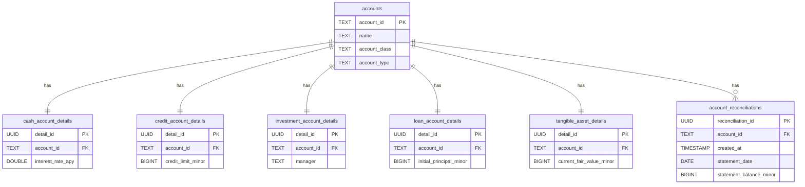

# Accounts Service Data Model

*See also: [Global Data Model Overview](./overview.md)*

The Accounts Service is responsible for managing the lifecycle of all financial accounts within the application. This includes creating, updating, and deactivating accounts, as well as managing their balances and specific attributes.

## Tables Owned by the Accounts Service

The Accounts Service owns the central `accounts` table and a set of detail tables that follow a "class table inheritance" pattern.

### `accounts`

This is the master table for all accounts. It stores the common information shared by every account, regardless of type.

-   **Purpose:** To act as the central registry for all user-created financial accounts.
-   **Grain:** One row per account.
-   **Columns:**
    -   `account_id` (PK, TEXT): A unique identifier for the account.
    -   `name` (TEXT): The user-defined name of the account (e.g., "Chase Checking").
    -   `account_type` (TEXT): The fundamental type of the account, either `asset` or `liability`.
    -   `account_class` (TEXT): A more specific classification of the account (e.g., `cash`, `credit`, `investment`, `loan`). This determines which detail table will be linked.
    -   `account_role` (TEXT): Defines how the account participates in the budget. The primary role is `on_budget`, meaning its funds are part of the user's main budget.
    -   `current_balance_minor` (BIGINT): The current balance of the account, stored in minor currency units (e.g., cents).
    -   `is_active` (BOOLEAN): A flag to soft-delete an account.
    -   `opened_on` (DATE): The date the account was opened.

> **Temporal boundary:** The `accounts` table is an authoritative cache of the latest balance per account, not a temporal history. All immutable, temporal ledger history lives in the `transactions` table. The application updates `accounts.current_balance_minor` in place (via `update_account_balance.sql`) to keep API reads fast while the versioned transaction log remains the source of truth for historical reconstruction. Every deploy now triggers a cache rebuild after migrations to realign balances with the ledger, and `scripts/rebuild-caches` can be used manually when needed.

### Account Detail Tables

These tables store attributes specific to a given `account_class`. They have a one-to-one relationship with the `accounts` table, linked by `account_id`. This design avoids cluttering the `accounts` table with dozens of columns that are only relevant to certain account types.

| Table                        | `account_class` | Notable Columns                                   | Purpose                                                                 |
| ---------------------------- | --------------- | ------------------------------------------------- | ----------------------------------------------------------------------- |
| `cash_account_details`       | `cash`          | `interest_rate_apy`                               | Stores details for standard checking and savings accounts.              |
| `credit_account_details`     | `credit`        | `apr`, `credit_limit_minor`                       | Stores details for credit cards.                                        |
| `investment_account_details` | `investment`    | `manager`, `risk_free_sweep_rate`                 | Stores details for brokerage or other investment accounts.              |
| `loan_account_details`       | `loan`          | `initial_principal_minor`, `term_end_date`        | Stores details for mortgages, auto loans, etc.                          |
| `tangible_asset_details`     | `tangible`      | `current_fair_value_minor`, `appraisal_date`      | Stores details for physical assets like real estate or vehicles.        |
| `accessible_asset_details`   | *other*         | `is_liquid`                                       | Stores details for other miscellaneous assets.                          |

A record is expected to exist in exactly one of these tables for each row in `accounts`. This relationship is enforced by application logic.

### Other Owned Tables

-   **`account_reconciliations`**: Stores the history of reconciliation events. Each row represents a "commit" where the user verified that the sum of cleared transactions in Dojo matched their bank statement balance. The `created_at` timestamp of the latest record acts as the checkpoint for determining which transactions appear in the next reconciliation worksheet.
-   **`tangible_assets`**: This table also stores information about tangible assets. Its purpose seems to overlap with `tangible_asset_details`. The application code should be consulted to understand the distinction. It may be a legacy table or used for a different purpose, such as tracking a history of asset values.

## Shared Tables Used by the Accounts Service

-   **`transactions` (Read-Only):** The Accounts Service reads from the `transactions` table to compute the current balance of an account. The `current_balance_minor` in the `accounts` table is a cache, and the sum of transactions for that account is the source of truth.

## Core Operations and Their Data Flows

### 1. Creating a New Account

This operation creates a new asset or liability, for example, adding a new savings account.

-   **Inputs:** Account name, type, class, opening balance, and any class-specific details.
-   **Sequence of SQL Changes:**
    1.  A new row is inserted into the `accounts` table with the common account data. The `current_balance_minor` is set to 0 initially.
    2.  A new row is inserted into the appropriate `*_account_details` table (e.g., `cash_account_details`) with the specific attributes for that account class.
    3.  A new transaction is created in the `transactions` table to represent the opening balance.
        -   `account_id`: The ID of the newly created account.
        -   `category_id`: `opening_balance`.
        -   `amount_minor`: The opening balance provided by the user.
    4.  The `current_balance_minor` on the `accounts` table is updated to match the opening balance.
-   **Transaction Boundary:** These steps are executed within a single database transaction to ensure atomicity. If any step fails, the entire operation is rolled back.

### 2. Deactivating an Account

This operation soft-deletes an account, hiding it from most views but preserving its history.

-   **Inputs:** `account_id` of the account to deactivate.
-   **Preconditions:** The account balance must typically be zero before it can be deactivated. This is enforced by the application.
-   **Sequence of SQL Changes:**
    1.  The `is_active` flag on the `accounts` table is set to `FALSE`.
    2.  The `is_active` flag on the corresponding `*_account_details` table is also set to `FALSE`.
-   **Postconditions:** The account will no longer appear in UI dropdowns for creating new transactions. Its transaction history remains intact.

## Invariants Local to the Service

-   **Balance Synchronization:** The `current_balance_minor` in the `accounts` table is a cached value. It must always be equal to the sum of all `amount_minor` values in the `transactions` table for that `account_id`. The application is responsible for updating the cached balance whenever a new transaction is created or an existing one is modified or deleted, and the cache rebuild command replays the ledger to self-heal historical drift.
-   **One-to-One Details:** Every account in the `accounts` table must have exactly one corresponding record in one of the `*_account_details` tables, determined by its `account_class`. This is enforced by application logic.
-   **Credit Account Categories:** For every `credit` class account, a corresponding "payment" category must exist in the `budget_categories` table. This is used to budget for credit card payments. This relationship is established by migration `0010_credit_payment_group.sql` and maintained by the application.
