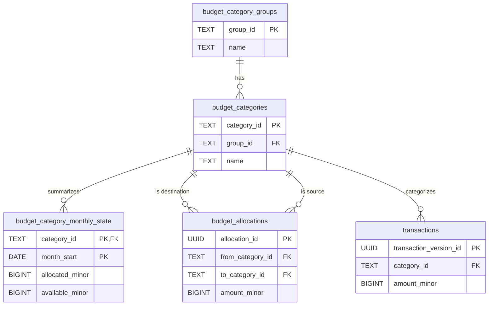

# Budgeting Service Data Model

*See also: [Global Data Model Overview](./overview.md)*

The Budgeting Service is the core of the envelope budgeting system. It is responsible for managing the budget structure (groups and categories), handling the allocation of funds to budget categories, and tracking the state of the budget from month to month.

## Tables Owned by the Budgeting Service

The Budgeting Service owns the tables that define the budget itself and the tables that track changes to it.

### `budget_category_groups`

This table defines the high-level organization of the budget.

-   **Purpose:** To group related budget categories together (e.g., "Monthly Bills", "Discretionary Spending").
-   **Grain:** One row per category group.
-   **Columns:**
    -   `group_id` (PK, TEXT): A unique identifier for the group.
    -   `name` (TEXT): The user-defined name of the group.
    -   `sort_order` (INTEGER): Determines the display order of the groups in the UI.
    -   `is_active` (BOOLEAN): A flag to soft-delete a group.

### `budget_categories`

This table contains all the "envelopes" that users can budget money into.

-   **Purpose:** To define the individual categories for budgeting.
-   **Grain:** One row per budget category.
-   **Columns:**
    -   `category_id` (PK, TEXT): A unique identifier for the category.
    -   `group_id` (FK, TEXT): Links the category to a `budget_category_groups`.
    -   `name` (TEXT): The user-defined name of the category (e.g., "Groceries").
    -   `is_system` (BOOLEAN): If `TRUE`, this is a system-managed category not intended for direct user manipulation (e.g., `opening_balance`).
    -   `goal_type` (TEXT): The type of goal set on the category (e.g., `target_balance`, `monthly_funding`).
    -   `goal_amount_minor` (BIGINT): The target amount for the goal.
    -   `goal_target_date` (DATE): The target date to reach the goal.

### `budget_allocations`

This table acts as a ledger for all explicit movements of money between budget categories.

-   **Purpose:** To track the funding of budget categories.
-   **Grain:** One row per allocation event.
-   **Columns:**
    -   `allocation_id` (PK, UUID): A unique identifier for the allocation.
    -   `month_start` (DATE): The budget month this allocation applies to.
    -   `from_category_id` (FK, TEXT): The source category. If NULL, funds are assumed to come from the general "Available to Budget" pool.
    -   `to_category_id` (FK, TEXT): The destination category.
    -   `amount_minor` (BIGINT): The amount of money being moved.

### `budget_category_monthly_state` (Cache)

This table is a performance-enhancing cache that stores summarized budget figures for each category and month.

-   **Purpose:** To provide fast reads for the monthly budget view without needing to re-aggregate all transactions.
-   **Grain:** One row per category per month.
-   **Columns:**
    -   `category_id` (PK, FK): The category being summarized.
    -   `month_start` (PK, DATE): The month being summarized.
    -   `allocated_minor` (BIGINT): Total funds explicitly allocated to this category for the month.
    -   `inflow_minor` (BIGINT): Total direct inflows (e.g., a returned purchase) to this category.
    -   `activity_minor` (BIGINT): Total outflows (spending) from this category for the month.
    -   `available_minor` (BIGINT): The final calculated balance (`allocated + inflow - activity`).

> **Mutable cache:** This table is not part of the temporal ledger. It is rebuilt transactionally each time allocations or ledger events occur, so the application issues `UPDATE` statements (see `upsert_category_monthly_state.sql`) to keep the cache synchronized while the immutable `transactions` table holds the full history.

## Shared Tables Used by the Budgeting Service

-   **`transactions` (Read-Only):** The Budgeting Service reads from the `transactions` table to calculate the `activity_minor` and `inflow_minor` for the `budget_category_monthly_state` cache. When a transaction is created or updated, the service needs to know its category, amount, and date to update the correct monthly state.

## Core Operations and Their Data Flows

### 1. Allocating Money to a Category

This is the fundamental budgeting operation: assigning a portion of available income to a specific spending category.

-   **Inputs:** `month_start`, `to_category_id`, `amount_minor`. (The `from_category_id` is implicitly the "Available to Budget" pool).
-   **Sequence of SQL Changes:**
    1.  A new row is inserted into `budget_allocations`.
        -   `month_start`, `to_category_id`, and `amount_minor` are set from the inputs.
        -   `from_category_id` is set to NULL or a system category ID like `available_to_budget`.
    2.  The `budget_category_monthly_state` table is updated for the given `month_start` and `to_category_id`.
        -   The `allocated_minor` value is increased by `amount_minor`.
        -   The `available_minor` value is also increased by `amount_minor`.
    3.  The `budget_category_monthly_state` for "Available to Budget" is also updated, decreasing its `available_minor`.
-   **Transaction Boundary:** These steps must be performed in a single database transaction.

### 2. Moving Money Between Categories

This operation reallocates funds from one category to another within the same month.

-   **Inputs:** `month_start`, `from_category_id`, `to_category_id`, `amount_minor`.
-   **Sequence of SQL Changes:**
    1.  A new row is inserted into `budget_allocations` with all fields populated.
    2.  The `budget_category_monthly_state` is updated for the source category (`from_category_id`):
        -   `allocated_minor` is decreased by `amount_minor`.
        -   `available_minor` is decreased by `amount_minor`.
    3.  The `budget_category_monthly_state` is updated for the destination category (`to_category_id`):
        -   `allocated_minor` is increased by `amount_minor`.
        -   `available_minor` is increased by `amount_minor`.
-   **Transaction Boundary:** All three updates are executed in a single transaction.

## Caches, Views, and Reconciliation

The `budget_category_monthly_state` table is the primary cache in the Budgeting Service.

-   **Updates:** It is updated synchronously by the application whenever a relevant event occurs (transaction recorded, budget allocated). The logic is handled in the service layer, not via database triggers.
-   **Drift:** Because updates are managed by the application, there is a risk of drift between the `transactions` log and the `budget_category_monthly_state` cache. For example, if a transaction fails mid-way, the cache could become inconsistent.
-   **Reconciliation:** The system currently relies on the atomicity of its transactions to prevent drift. There is no evidence of a background reconciliation job to periodically rebuild the cache from the `transactions` table. A manual rebuild may be required if data becomes inconsistent.

## Invariants Local to the Service

-   **Conservation of Money:** Within a given month, the sum of all `available_minor` balances across all categories (including "Available to Budget") must remain constant during a reallocation operation. When money is allocated from the main pool, the total budgeted amount should not change. This is enforced by the application logic during allocation operations.
-   **Cache Correctness:** For any given category and month, the `activity_minor` value in the `budget_category_monthly_state` table must equal the sum of all `amount_minor` from debit transactions in the `transactions` table assigned to that category within that month.
-   **Group-Category Relationship:** Every `budget_category` must belong to a `budget_category_group`. While not enforced by a foreign key constraint in DuckDB, this is a firm application-level expectation.
