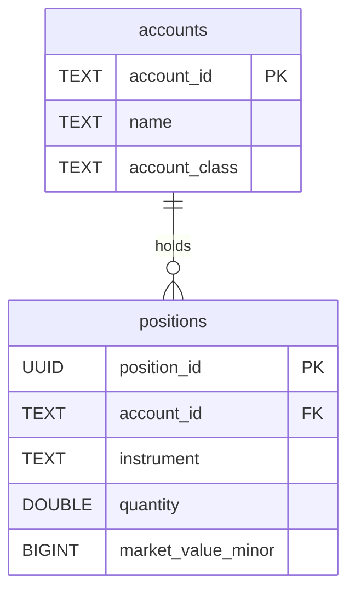

# Investments Service Data Model

*See also: [Global Data Model Overview](./overview.md)*

The Investments Service is responsible for tracking investment positions held within investment-class accounts. It manages the details of these positions, such as the quantity and market value of different financial instruments.

## Tables Owned by the Investments Service

The service's primary responsibility is the `positions` table.

### `positions`

This table stores the individual investment positions, such as holdings of stocks, bonds, or mutual funds.

-   **Purpose:** To track the quantity and value of each financial instrument held in a user's investment accounts.
-   **Grain:** One row per instrument per account.
-   **Columns:**
    -   `position_id` (PK, UUID): The unique identifier for this position.
    -   `account_id` (FK, TEXT): The investment account that holds this position.
    -   `instrument` (TEXT): A ticker or other identifier for the financial instrument (e.g., "AAPL", "VTSAX").
    -   `quantity` (DOUBLE): The number of shares or units held.
    -   `market_value_minor` (BIGINT): The total current market value of the position, in minor currency units.
    -   `is_active` (BOOLEAN): A flag to indicate if the position is currently held.
    -   `recorded_at` (TIMESTAMP): The timestamp when this position data was last updated.

## Shared Tables Used by the Investments Service

The Investments Service relies on tables from other services to function correctly.

-   **`accounts` (Read-Only):** The service reads from the `accounts` table to link positions to a specific account and to ensure the account has an `account_class` of `investment`.
-   **`investment_account_details` (Read-Only):** This table, owned by the Accounts Service, provides specific metadata about the investment account that may be relevant for display or calculations within the Investments Service.
-   **`transactions` (Read-Only):** While not directly joined, the service may use transaction data (e.g., "buy" or "sell" transactions) to reconcile position quantities or to provide a more detailed view of investment performance.

## Core Operations and Their Data Flows

### 1. Adding a New Position

This operation records a new investment holding in an account.

-   **Inputs:** `account_id`, `instrument`, `quantity`, `market_value_minor`.
-   **Preconditions:** The `account_id` must correspond to an active account with `account_class = 'investment'`.
-   **Sequence of SQL Changes:**
    1.  A new row is inserted into the `positions` table with the provided details.
    2.  The application logic then updates the `current_balance_minor` of the parent investment account in the `accounts` table. The balance of an investment account is the sum of the `market_value_minor` of all its active positions.
-   **Transaction Boundary:** The insertion and the update to the account balance are performed in a single database transaction.

### 2. Updating a Position's Value or Quantity

This operation occurs when the user buys or sells shares, or when market prices are updated.

-   **Inputs:** `position_id`, new `quantity` and/or `market_value_minor`.
-   **Sequence of SQL Changes:**
    1.  The existing row in the `positions` table is updated with the new `quantity` and `market_value_minor`. The `recorded_at` timestamp is also updated.
    2.  The application recalculates the total balance for the parent account by summing the market values of all its positions and updates the `current_balance_minor` in the `accounts` table.
-   **Transaction Boundary:** Both updates occur within a single transaction.

### 3. Closing a Position

This occurs when an instrument is sold completely.

-   **Inputs:** `position_id`.
-   **Sequence of SQL Changes:**
    1.  The `is_active` flag on the `positions` row is set to `FALSE`. The `quantity` and `market_value_minor` may be set to 0.
    2.  The parent account's balance is recalculated and updated in the `accounts` table.
-   **Transaction Boundary:** Both updates occur within a single transaction.

## Invariants Local to the Service

-   **Account Balance Synchronization:** The `current_balance_minor` of an investment account in the `accounts` table must equal the sum of `market_value_minor` for all active positions associated with that `account_id`. This is a cache that is maintained by the application logic of the Investments Service.
-   **Position Uniqueness:** For a given `account_id`, there should only be one active position per `instrument`. This is enforced by application logic and potentially a unique index on `(account_id, instrument, is_active)`.
-   **Account Class:** All positions must belong to an account where `account_class` is `investment`.
