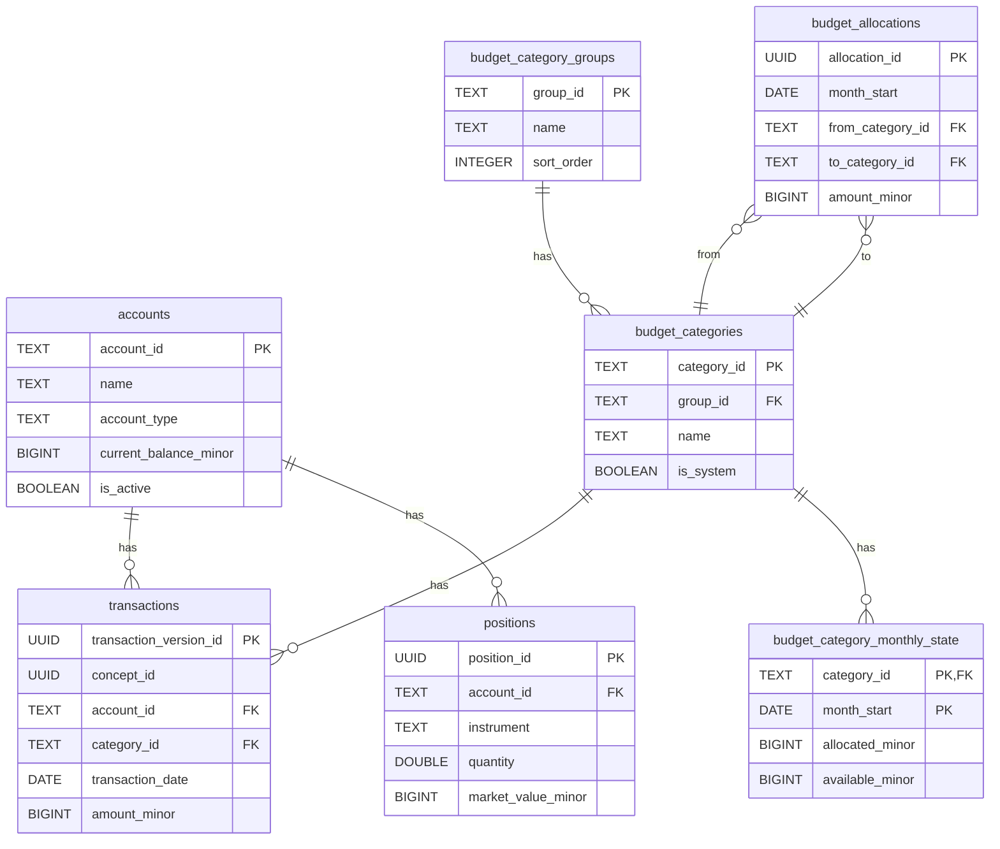

# Data Model Overview

This document provides a canonical overview of the SQL data model for the Dojo personal finance application. It is intended for developers and advanced users who need to understand how the system stores and organizes its data.

The application is an envelope-style budgeting and net-worth tracking tool. It helps users manage their finances by allocating income into virtual "envelopes" (budget categories), tracking spending against those envelopes, and monitoring the value of their assets and liabilities over time.

This document covers the global schema. For domain-specific details, please refer to the service-level documentation linked below.

## Global Schema Overview

The data model is designed around a few core entities: accounts, budget categories, and transactions. It follows a normalized, relational structure with a few key design patterns:

-   **Central Journal:** The `transactions` table acts as a central, immutable journal of all financial events. It is designed as a Type 2 Slowly Changing Dimension (SCD), meaning that edits to transactions create new versions rather than overwriting old data. This provides a full, auditable history.
-   **Service-Oriented Tables:** Tables are grouped logically by the service that owns them. For example, `budget_categories` and `budget_allocations` belong to the Budgeting service, while `accounts` and `positions` belong to the Accounts and Investments services.
-   **Monthly Caching:** For performance, the `budget_category_monthly_state` table acts as a cache of budget data aggregated by month. This avoids costly re-calculations when viewing monthly budget summaries. Migrations now replay the ledger to rebuild this cache automatically, and `scripts/rebuild-caches` can be run manually whenever data drift is suspected.
-   **Class Table Inheritance:** The `accounts` table uses a "class table inheritance" pattern. A central `accounts` table stores common attributes, while specialized `*_account_details` tables store data specific to each account type (e.g., `credit_account_details`, `investment_account_details`).

## Table Inventory

The following tables make up the core data model.

### Core Tables

| Table                              | Purpose                                                                                | Grain of Row                                    | Primary Key (PK)       | Foreign Keys (FKs)                                | Notes                                                                                                                                                              |
| ---------------------------------- | -------------------------------------------------------------------------------------- | ----------------------------------------------- | ---------------------- | ------------------------------------------------- | ------------------------------------------------------------------------------------------------------------------------------------------------------------------ |
| `accounts`                         | Stores all asset and liability accounts.                                               | One row per account.                            | `account_id` (TEXT)    | -                                                 | The central hub for all financial accounts, from checking to investment to loans.                                                                                  |
| `budget_category_groups`           | Defines groups for organizing budget categories.                                       | One row per category group.                     | `group_id` (TEXT)      | -                                                 | Provides a hierarchical structure for the budget (e.g., "Bills", "Everyday Expenses").                                                                             |
| `budget_categories`                | Stores all budget categories, both user-defined and system-level.                      | One row per category.                           | `category_id` (TEXT)   | `group_id` -> `budget_category_groups`            | The "envelopes" in the budgeting system. Can have goals associated with them.                                                                                      |
| `transactions`                     | An immutable, versioned log of all financial transactions.                             | One row per version of a transaction.           | `transaction_version_id` (UUID) | `account_id` -> `accounts`, `category_id` -> `budget_categories` | Implemented as a Type 2 SCD. `concept_id` links different versions of the same transaction.                                                                    |
| `budget_allocations`               | Records the explicit movement of funds between budget categories.                      | One row per allocation event.                   | `allocation_id` (UUID) | `from_category_id`, `to_category_id` -> `budget_categories` | The mechanism for "filling" the envelopes. `from_category_id` can be NULL, representing an allocation from the general "Available to Budget" pool.                  |
| `positions`                        | Stores investment positions within an investment account.                              | One row per instrument in an account.           | `position_id` (UUID)   | `account_id` -> `accounts`                        | Tracks the quantity and market value of stocks, funds, etc.                                                                                                        |
| `tangible_assets`                  | Stores details about tangible assets like property or vehicles.                        | One row per tangible asset.                     | `tangible_id` (UUID)   | `account_id` -> `accounts`                        | Represents physical assets that contribute to net worth.                                                                                                           |

### Account Detail Tables (Class Table Inheritance)

These tables store metadata for specific account classes. Each has a one-to-one relationship with the `accounts` table.

| Table                          | Purpose                                                   | PK                     | FK                         |
| ------------------------------ | --------------------------------------------------------- | ---------------------- | -------------------------- |
| `cash_account_details`         | Details for checking/savings accounts (e.g., interest rate). | `detail_id` (UUID)     | `account_id` -> `accounts` |
| `credit_account_details`       | Details for credit cards (e.g., credit limit, APR).       | `detail_id` (UUID)     | `account_id` -> `accounts` |
| `investment_account_details`   | Details for brokerage accounts (e.g., manager).           | `detail_id` (UUID)     | `account_id` -> `accounts` |
| `loan_account_details`         | Details for loans (e.g., principal, interest rate).       | `detail_id` (UUID)     | `account_id` -> `accounts` |
| `tangible_asset_details`       | Details for tangible assets (e.g., appraisal date).       | `detail_id` (UUID)     | `account_id` -> `accounts` |
| `accessible_asset_details`     | Details for other accessible assets.                      | `detail_id` (UUID)     | `account_id` -> `accounts` |

### Derived / Cache Tables

| Table                              | Purpose                                                                | Grain of Row                         | PK                               | FKs                                     | Notes                                                                                                                                                                                                                          |
| ---------------------------------- | ---------------------------------------------------------------------- | ------------------------------------ | -------------------------------- | --------------------------------------- | ------------------------------------------------------------------------------------------------------------------------------------------------------------------------------------------------------------------------------ |
| `budget_category_monthly_state`    | A cache of monthly budget category summaries.                          | One row per category per month.      | `(category_id, month_start)`     | `category_id` -> `budget_categories`    | Stores allocated, inflow, activity, and available balances. This is a performance optimization to avoid recalculating budget states from the transaction log on every request. It is a source of potential drift if not managed carefully. |

## Entity-Relationship Diagram

## Services and Their Slices of the Model

The data model is logically partitioned across several services.

-   **Accounts Service**  
    *Responsibilities:* Manages the lifecycle of all financial accounts, their balances, and their specific attributes.  
    *Owned Tables:* `accounts`, `cash_account_details`, `credit_account_details`, `investment_account_details`, `loan_account_details`, `tangible_asset_details`, `accessible_asset_details`.  
    *Shared Tables:* `transactions` (read-only for balance calculations).  
    *See also: [Accounts Service Data Model](./accounts-service.md)*

-   **Budgeting Service**  
    *Responsibilities:* Manages budget structure, goals, and the allocation of funds.  
    *Owned Tables:* `budget_category_groups`, `budget_categories`, `budget_allocations`, `budget_category_monthly_state`.  
    *Shared Tables:* `transactions` (read-only for calculating category activity).  
    *See also: [Budgeting Service Data Model](./budgeting-service.md)*

-   **Transactions Service**  
    *Responsibilities:* Records, edits, and manages all financial transactions.  
    *Owned Tables:* `transactions`.  
    *Shared Tables:* `accounts`, `budget_categories` (for validation and linking).  
    *See also: [Transactions Service Data Model](./transactions-service.md)*

-   **Investments Service**  
    *Responsibilities:* Tracks investment positions and performance.  
    *Owned Tables:* `positions`.  
    *Shared Tables:* `accounts`, `investment_account_details`, `transactions`.  
    *See also: [Investments Service Data Model](./investments-service.md)*

-   **Net Worth Service**  
    *Responsibilities:* Calculates and reports on the user's net worth over time.  
    *Owned Tables:* None (it is a read-only, computational service).  
    *Shared Tables:* `accounts`, `positions`, `tangible_assets`, `transactions`.  
    *See also: [Net Worth Service Data Model](./net-worth-service.md)*

## Caching, Derived Views, and Drift

The most significant derived table is `budget_category_monthly_state`.

-   **What it caches:** This table stores the four key figures for each budget category for a given month:
    -   `allocated_minor`: Funds explicitly assigned to the category.
    -   `inflow_minor`: Inflows directly categorized to this category.
    -   `activity_minor`: Outflows (spending) from the category.
    -   `available_minor`: The remaining balance (`allocated + inflow - activity`).
-   **How it's populated:** The application logic updates this table whenever an event occurs that affects the budget. This includes:
    -   Creating or updating a transaction.
    -   Creating or updating a budget allocation.
-   **Consistency:** Updates to `budget_category_monthly_state` are expected to happen within the same database transaction as the event that triggers them. For example, when a new transaction is recorded, both the `transactions` table and the `budget_category_monthly_state` table are updated together. This minimizes drift. However, because the logic lives in the application layer, there is a risk of drift if a transaction fails or if a background job is interrupted. The system does not appear to have an automatic reconciliation mechanism, so maintaining this cache is the responsibility of the application code.

## Invariants and Best Practices

-   **Immutability of Transactions:** The `transactions` table is effectively append-only. Edits result in a new row with the same `concept_id`, and the old row is marked as inactive (`is_active = FALSE`, `valid_to` is set). This preserves a full audit trail.
-   **Balance Consistency:** The balance of a budget account (`accounts.current_balance_minor`) should, in theory, equal the sum of all `available_minor` balances in `budget_category_monthly_state` for the current month, plus any "Available to Budget" funds. This invariant is enforced by application logic, not by the database.
-   **System Categories:** Certain budget categories are marked with `is_system = TRUE`. These are used for special operations like opening balances, balance adjustments, and transfers. They are generally not editable by the user.
-   **Clear Primary Keys:** All tables have clear, explicit primary keys (`account_id`, `category_id`, UUIDs, etc.), making joins and references straightforward.
