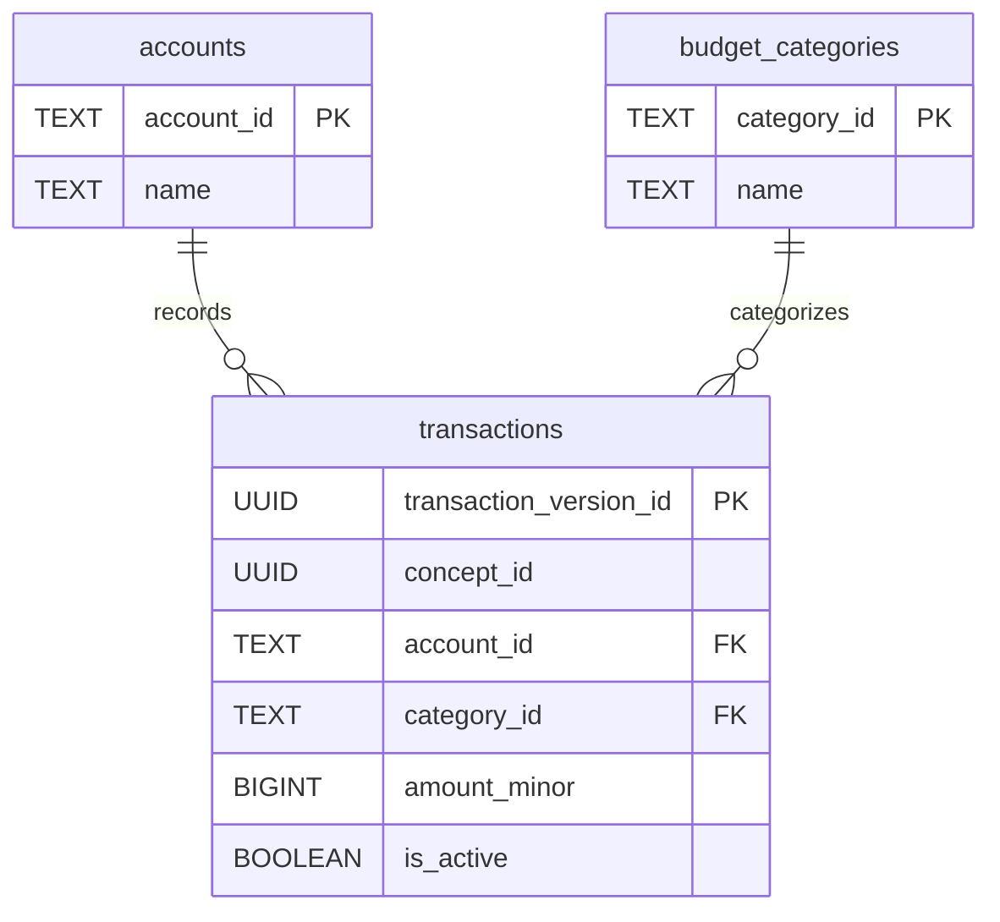

# Transactions Service Data Model

*See also: [Global Data Model Overview](./overview.md)*

The Transactions Service is responsible for managing the central journal of all financial events. It handles the creation, modification, and deletion of transactions, ensuring data integrity and maintaining a complete, auditable history of all changes.

## Tables Owned by the Transactions Service

The service's primary responsibility is the `transactions` table.

### `transactions`

This table is the immutable, versioned log of all financial activities. It is designed as a Type 2 Slowly Changing Dimension (SCD), which means that any "edit" or "delete" operation creates a new version of the transaction record rather than overwriting the existing one.

-   **Purpose:** To provide a complete and auditable history of every financial event across all accounts.
-   **Grain:** One row per *version* of a transaction.
-   **Columns:**
    -   `transaction_version_id` (PK, UUID): The unique identifier for this specific version of the transaction.
    -   `concept_id` (UUID): The identifier that links all versions of a single logical transaction. A query for a specific `concept_id` will return the entire history of a transaction.
    -   `account_id` (FK, TEXT): The account this transaction belongs to.
    -   `category_id` (FK, TEXT): The budget category this transaction is assigned to.
    -   `transaction_date` (DATE): The date the transaction occurred.
    -   `amount_minor` (BIGINT): The value of the transaction in minor currency units. Positive values are inflows (income), and negative values are outflows (expenses).
    -   `memo` (TEXT): A user-provided note.
    -   `status` (TEXT): The lifecycle status of the transaction (e.g., `pending`, `cleared`).
    -   `valid_from` (TIMESTAMP): The timestamp when this version of the transaction became active.
    -   `valid_to` (TIMESTAMP): The timestamp when this version of the transaction was superseded. A value of `9999-12-31` indicates this is the currently active version.
    -   `is_active` (BOOLEAN): A boolean flag that is `TRUE` if this is the current, active version of the transaction. This is a denormalization of `valid_to` for easier querying.

## Shared Tables Used by the Transactions Service

The Transactions Service reads from several other tables to validate new transactions and to link them into the broader data model.

-   **`accounts` (Read-Only):** Used to verify that the `account_id` for a new transaction exists and is active.
-   **`budget_categories` (Read-Only):** Used to verify that the `category_id` for a new transaction exists and is active.

## Core Operations and Their Data Flows

The SCD Type 2 design of the `transactions` table makes its operations distinct from those on traditional mutable tables.

### 1. Creating a New Transaction

This is the most common operation, representing a new expense, income, or transfer.

-   **Inputs:** `account_id`, `category_id`, `transaction_date`, `amount_minor`, `memo`, etc.
-   **Sequence of SQL Changes:**
    1.  A new `concept_id` (UUID) is generated by the application.
    2.  A new row is inserted into the `transactions` table.
        -   `transaction_version_id` is a new UUID.
        -   `concept_id` is the newly generated ID.
        -   All other fields are populated from the inputs.
        -   `valid_from` is set to the current timestamp.
        -   `valid_to` is set to the "end of time" (`9999-12-31`).
        -   `is_active` is set to `TRUE`.
    3.  The application then triggers updates to cached tables, such as `accounts.current_balance_minor` and `budget_category_monthly_state`.
-   **Transaction Boundary:** The insertion of the transaction and the updates to the cache tables are performed in a single database transaction.

### 2. Editing an Existing Transaction

Editing a transaction does not involve an `UPDATE` statement on the existing row. Instead, it deactivates the old version and creates a new one.

-   **Inputs:** `concept_id` of the transaction to edit, plus the new data for the transaction.
-   **Sequence of SQL Changes:**
    1.  **Deactivate the old version:** The currently active row for the given `concept_id` is updated.
        -   `valid_to` is set to the current timestamp.
        -   `is_active` is set to `FALSE`.
    2.  **Insert the new version:** A new row is inserted into `transactions`.
        -   `transaction_version_id` is a new UUID.
        -   `concept_id` is the same as the edited transaction.
        -   The transaction data is populated with the new, updated values.
        -   `valid_from` is the current timestamp.
        -   `valid_to` is the "end of time".
        -   `is_active` is `TRUE`.
    3.  The application calculates the *delta* (the difference between the old and new transaction amounts/dates/categories) and applies it to the cache tables.
-   **Transaction Boundary:** Both the update and the insert, along with the cache updates, occur in one transaction.

### 3. Deleting a Transaction

A "delete" is logically equivalent to an "edit" where the new version has an amount of zero or is marked in a special way. In this system, it means deactivating the current version without creating a new one.

-   **Inputs:** `concept_id` of the transaction to delete.
-   **Sequence of SQL Changes:**
    1.  The currently active row for the given `concept_id` is updated.
        -   `valid_to` is set to the current timestamp.
        -   `is_active` is set to `FALSE`.
-   **Transaction Boundary:** This update and any corresponding cache adjustments happen in a single transaction.

## Invariants Local to the Service

-   **Uniqueness of Active Version:** For any given `concept_id`, there can be at most one row where `is_active` is `TRUE` (or where `valid_to` is the "end of time"). This is the most critical invariant and is enforced by a unique index on `(concept_id, is_active)`.
-   **Chronological Integrity:** For any `concept_id`, the `valid_from` timestamp of a version must be greater than or equal to the `valid_to` timestamp of the preceding version. The application logic is responsible for ensuring this.
-   **Referential Integrity:** The `account_id` and `category_id` on any active transaction must point to an existing and active account and category. This is enforced by application-level validation before insertion.
